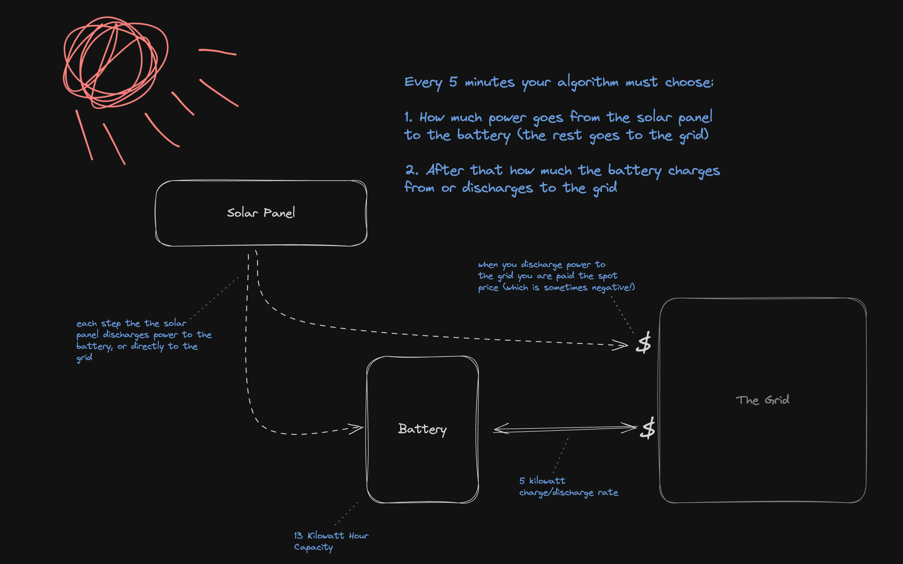
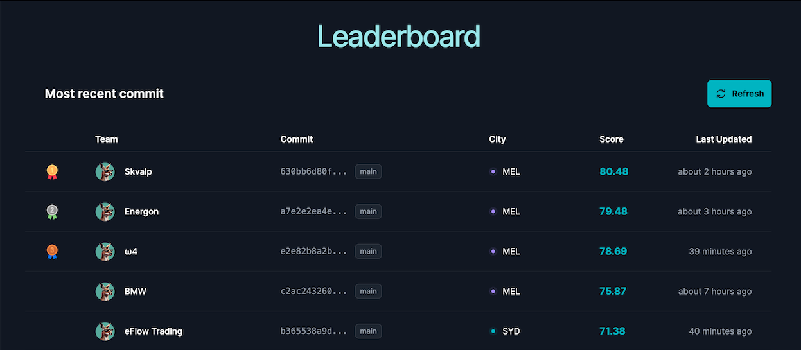
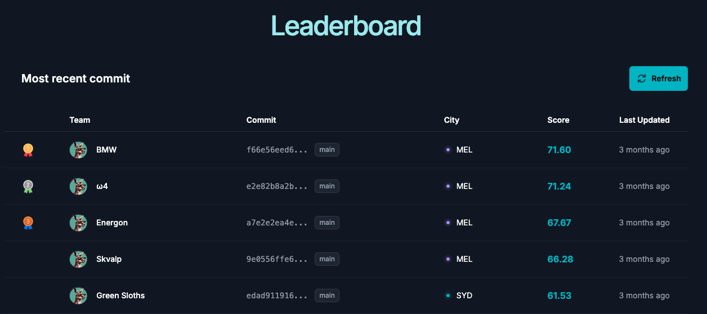

# MLAI Green Battery Hack - Team Skvalp

## Competition Overview

The goal of [MLAI Green Battery Hack](https://www.mlai.au/hackathon) is to develop a strategy to optimise battery operations within an energy market simulation. Our challenge is to create algorithms, or policies, that expertly manage batery charging and discharging in response to real-time market data and incoming energy from a simulated solar panel.

## Accomplishments

We are proud to have achieved a final ranking of **4th place** in the competition amongst the many teams formed in Melbourne and Sydney. Our team, Skvalp, have incorporated a similar approach as the 1st place winners team, which will be discussed in the following [section](#strategy-overview). Due to some technical issues, we had to disable a function in order for our algorithm to work properly in the final leaderboard simulation, which resulted in a lower score than expected. However, we are proud of our team's efforts and the final result as the process was very rewarding for me.

Screenshot of the provisional leaderboard rankings before the cut-off deadline for code submissions, taken at 4:59PM on 21st April 2024. We were so excited that we're provisionally **1st**!

Screenshot of the final leaderboard rankings after the competition ended.

## Our Approach
Disclaimer: As some of our team members are working on a start-up company, due to proprietary reasons, I have removed some of the code and details used in our strategy. However, I will still provide a high-level explanation of the functionalities of the redacted code.

## Hackathon Details

For more information about the guidelines provided by the hackathon, please check out [hackathon.md](hackathon.md).

## Contributors

Thanks to all the team members of Skvalp who have contributed to this project:

- Jithin George, [@j-georgeAU](https://github.com/j-georgeAU)
- Vishnu Vinayamohanan, [@vihnuav08](https://github.com/vishnuav08)
- Bigi Philip, [@bigiphilip](https://github.com/bigiphilip)
- Eric Kim, [@EricKim9724](https://github.com/EricKim9724)

Special thanks to [MLAI Aus](https://www.mlai.au/) for always organising such amazing hackathons and the [sponsors]() that made this happen!